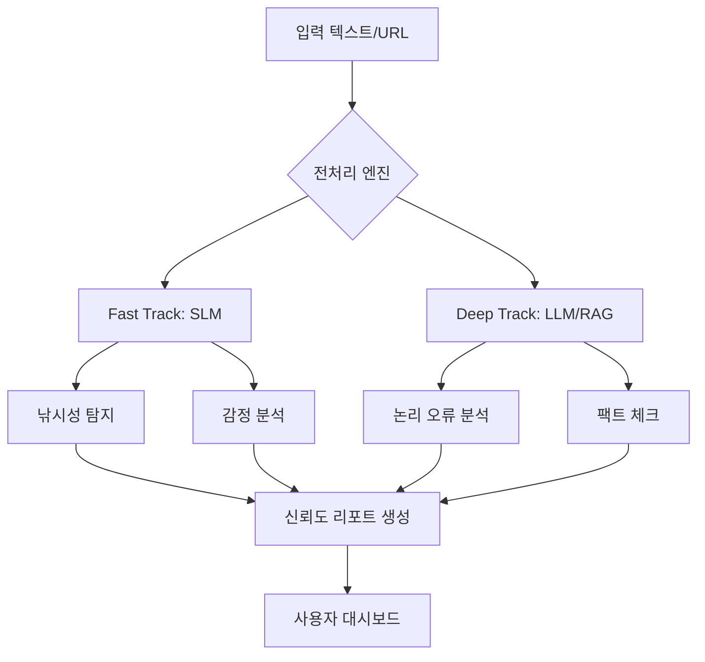

# 🔍 Credibility Scout: 가짜 뉴스 및 선동 탐지 플랫폼

> "정보의 바다에서 가려내는 진실의 나침반"

**Credibility Scout**는 딥러닝 기술을 활용하여 뉴스 기사와 온라인 게시글의 신뢰도를 분석하고, 낚시성 콘텐츠 및 논리적 왜곡을 탐지하는 AI 기반 분석 시스템입니다.

---

## 📖 1. 프로젝트 개요 (Overview)
현대 정보 사회에서 가짜 뉴스, 낚시성 기사, 그리고 교묘한 선동적 문구는 여론을 왜곡하고 사회적 갈등을 야기합니다. **Credibility Scout**는 이러한 문제를 해결하기 위해 사용자가 접하는 텍스트의 신뢰도를 데이터 기반으로 정밀 분석하여 객관적인 지표를 제공합니다.

단순 '참/거짓' 판별을 넘어, **논리적 오류, 감정적 조작, 정치적 편향성**을 다각도로 분석하여 사용자의 비판적 사고를 돕는 도구를 지향합니다.

---

## 🎯 2. 핵심 목표 (Core Goals)

### 🎣 낚시성 기사 탐지 (Clickbait Detection)
*   제목과 본문의 시맨틱 매칭(Semantic Matching)을 통해 클릭 유도용 낚시성 기사 식별.
*   자극적인 키워드 및 패턴 분석을 통한 낚시 지수 산출.

### 🧠 논리적 오류 분석 (Logical Fallacy Detection)
*   `LogiLogi` 데이터셋 등을 활용하여 인신공격, 권위에의 호소 등 기만적 논증 식별.
*   주장의 타당성을 검토하여 논리적 허점을 사용자에게 알림.

### 🎭 감정적 선동 탐지 (Loaded Language Analysis)
*   공포, 분노 유발 등 감정을 자극하여 판단을 흐리게 하는 수법 탐지.
*   객관적 사실과 주관적 감정 표현의 비율 분석.

### 🌐 RAG 기반 팩트체크 (Fact-Checking with RAG)
*   **External Knowledge Base** 연동을 통한 실시간 정보 검증.
*   주장과 상반되는 근거 자료를 함께 제시하여 균형 잡린 시각 제공.

---

## 🛠️ 3. 기술 스택 (Tech Stack)

### 🤖 AI / Machine Learning
*   **Small Language Models (SLM):** KLUE-BERT, DeBERTa-v3 (빠른 분석 및 감정 분류)
*   **Large Language Models (LLM):** Gemma, GPT-4 (복잡한 추론 및 리포트 생성)
*   **Frameworks:** PyTorch, Hugging Face `transformers`, LangChain
*   **Techniques:** Fine-tuning, LoRA, RAG (Retrieval-Augmented Generation)

### 💻 Frontend & Backend
*   **Frontend:** Next.js, Tailwind CSS, Framer Motion
*   **Backend:** FastAPI (Python), Docker
*   **Database:** Supabase (PostgreSQL + `pgvector`)

---

## 🏗️ 4. 시스템 아키텍처 (Architecture)

---

## 🚀 5. 현재 개발 현황 (Current Status)
*   [x] **데이터 수집 및 전처리:** 낚시성 기사 탐지 데이터셋 구축 완료.
*   [x] **모델 학습:** KLUE-BERT 기반 낚시성 기사 분류 모델 파인튜닝 완료.
*   [ ] **RAG 통합:** 외부 지식 베이스 검색 엔진 연동 중.
*   [ ] **MVP 배포:** 웹 기반 분석 대시보드 개발 중.

---

## 📄 6. 라이선스 (License)
본 프로젝트는 교육 및 연구 목적으로 개발되었습니다.

---
*Created by Kwangmyung Moon (AI-Lawyer Project / Report Domain)*
