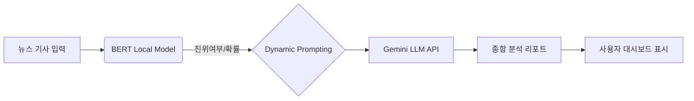
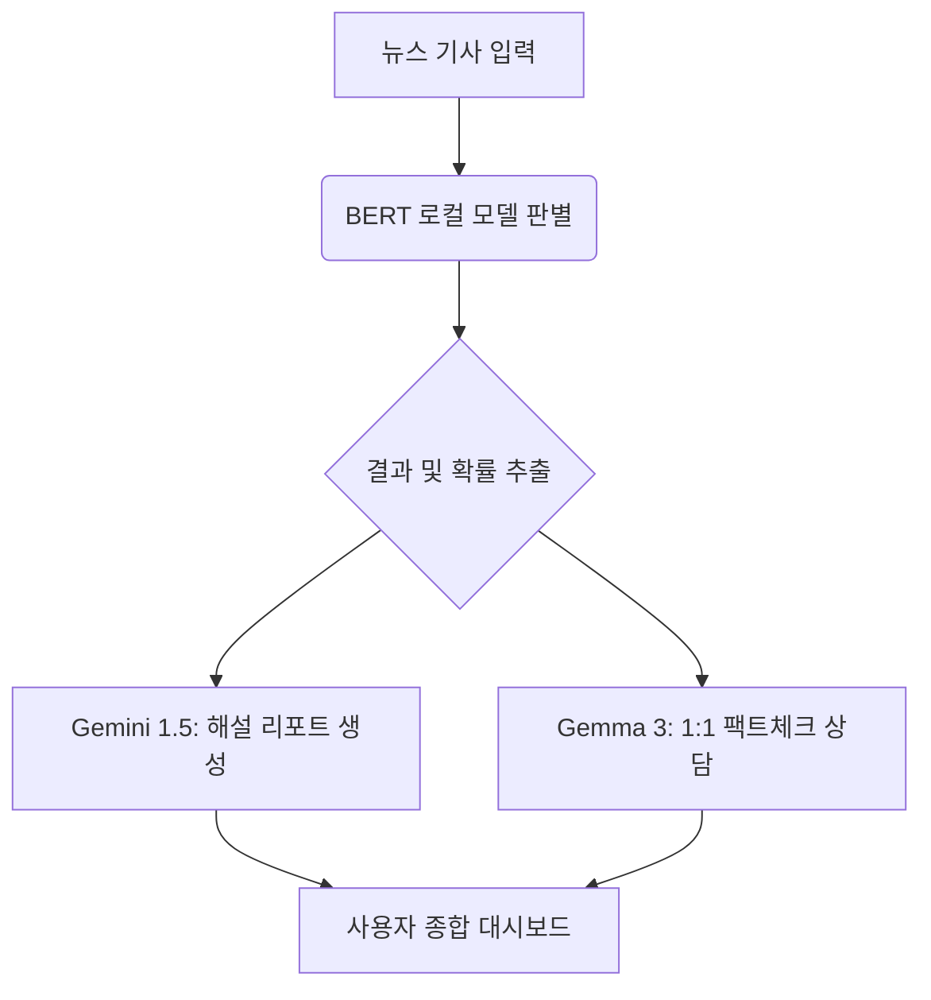

# 🤖 LLM 서비스 연동 보고서: 심층 해설 및 팩트체크 리포트

> **"BERT의 정밀 판별과 Gemini의 심층 비평이 결합된 하이브리드 뉴스 분석 시스템"**

---

## 1. 분류 결과 기반 프롬프트 생성 (Prompt Engineering)

### 📊 뉴스 분석 및 결과 전달 (BERT to LLM)
*   **데이터 흐름**: 로컬 BERT 모델이 탐지한 진위 여부(`is_fake`)와 확률(`confidence`)을 Gemini API에 실시간 전달

```python
# [1] 모델 호출 및 판별 결과 추출 (predict.py)
inputs = self.tokenizer(
    title, 
    content, 
    return_tensors="pt", 
    truncation=True, 
    max_length=512
).to(self.device)

with torch.no_grad():
    outputs = self.model(**inputs)
    logits = outputs.logits
    probs = F.softmax(logits, dim=-1)
    
    clickbait_prob = probs[0][0].item()
    is_clickbait = clickbait_prob > 0.5
```

*   **동적 프롬프팅**: 판별 결과에 따라 최적의 해설을 유도하도록 프롬프트를 동적으로 구성

```python
# [2] 판별 결과에 따른 동적 프롬프트 생성 (explainer.py)
status = "가짜 뉴스(Fake)" if is_fake else "진짜 뉴스(Real)"

prompt = f"""
당신은 뉴스 팩트체크 전문가이자 비평가입니다. 
인공지능 판별 모델이 다음 뉴스를 분석한 결과, 이 뉴스는 {confidence:.1f}%의 확률로 [{status}]라고 판단했습니다.

[뉴스 본문]
{text}

[수행 작업]
1. 이 뉴스가 {status}로 판단된 이유를 뉴스 문체, 논리적 흐름, 내용의 현실성 측면에서 분석하세요.
2. 만약 가짜 뉴스로 판단되었다면, 어떤 부분이 전형적인 선동이나 조작의 특징을 보이는지 지적하세요.
3. 진짜 뉴스로 판단되었다면, 어떤 점이 신뢰도를 높이는지 설명하세요.
4. 독자가 이 뉴스를 접할 때 주의해야 할 점을 한 줄로 요약하세요.

결과는 일반 독자가 이해하기 쉽게 친절하면서도 전문적인 어조로 작성해주세요.
출력은 반드시 한국어로 해주세요.
"""
```
    *   *정상 뉴스일 때*: 보도의 객관성 및 신뢰 요인 분석 강조
    *   *낚시성 뉴스일 때*: 조작 기법 및 선동적 문체 지적 강조

### ✍️ 해설 리포트 생성 로직
*   **페르소나 설정**: "뉴스 팩트체크 전문가이자 비평가" 역할을 부여하여 객관적이고 전문적인 논조 유지
*   **다각도 분석**: 문체(Style), 논리(Logic), 현실성(Reality)의 3가지 측면에서 심층 분석 수행

---

## 2. Gemini LLM의 역할 및 기능 (Role of Gemini)

### 🌟 핵심 분석 기능
*   **맞춤형 해설**: 사용자가 판별 결과의 이유를 직관적으로 이해할 수 있도록 쉬운 언어로 풀어서 설명
*   **선동적 특징 포착**: 감정을 자극하거나 공포를 유발하는 전형적인 'Loaded Language' 수법 식별
*   **비판적 사고 가이드**: 독자가 유사한 뉴스를 접할 때 스스로 필터링할 수 있는 '한 줄 주의사항' 제공

### 🛠️ 기술적 특징 (Technical Stack)
*   **모델**: `gemini-flash-latest` (초저지연 응답 및 대규모 문맥 처리 가능)
*   **Zero-shot 탐지**: 로컬 모델 없이도 LLM이 직접 팩트체크를 수행할 수 있는 독립 모드(`analyze_news_from_scratch`) 지원
*   **규격화된 출력**: JSON 포맷을 통한 데이터 추출로 다른 시스템과의 확장성 확보

---

## 🏗️ 시스템 아키텍처 (System Architecture)



---

## 3. Gemma 3 팩트체크 상담소 (Chatbot Service)

> **"분석 결과를 바탕으로 사용자와 심층 대화를 나누는 지능형 팩트체크 보조 전문가"**

### 💬 대화 맥락 주입 및 세션 관리 (gemma_chat.py)
*   **시스템 프롬프트**: 분석된 뉴스의 본문, 진위 결과, 해설 리포트를 챗봇의 **Segment Context**로 주입하여 일관성 있는 답변 유도.

```python
# [3] Gemma 3 챗봇 초기화 및 맥락 주입
def start_conversation(self, context_text, detection_result):
    system_instruction = f"""
    당신은 '팩트체크 보조 전문가' Gemma입니다.
    [분석 정보]
    - 분석 대상 기사: {context_text}
    - 판별 결과: {detection_result['status']} ({detection_result['confidence']:.1f}% 신뢰도)
    - 분석 요약: {detection_result['explanation']}

    [대화 원칙]
    1. 사용자가 기사의 특정 부분에 대해 물어보면 뉴스비평가 관점에서 답변하세요.
    2. 왜 인공지능이 그렇게 판단했는지(문체, 논리적 비약 등)를 함께 추론하세요.
    """
    self.chat_session = self.model.start_chat(history=[])
    return self.chat_session.send_message(system_instruction)
```

### 🌟 챗봇의 주요 기능
1.  **심층 질의응답**: 분석 리포트에서 다루지 못한 세부적인 의문점(예: "이 기사의 특정 구절이 왜 선동적인가요?")에 대해 답변.
2.  **데이터 기반 추론**: 단순한 텍스트 분석을 넘어, 딥러닝 모델의 판단 근거를 언어 모델의 지식으로 보완하여 설명.
3.  **사용자 교육**: 팩트체크 가이드를 실시간 제공하여 독자의 비판적 사고 능력 배양 지원.

### 🏗️ 통합 시스템 아키텍처 (Final)



---
*Created by Kwangmyung Moon*
